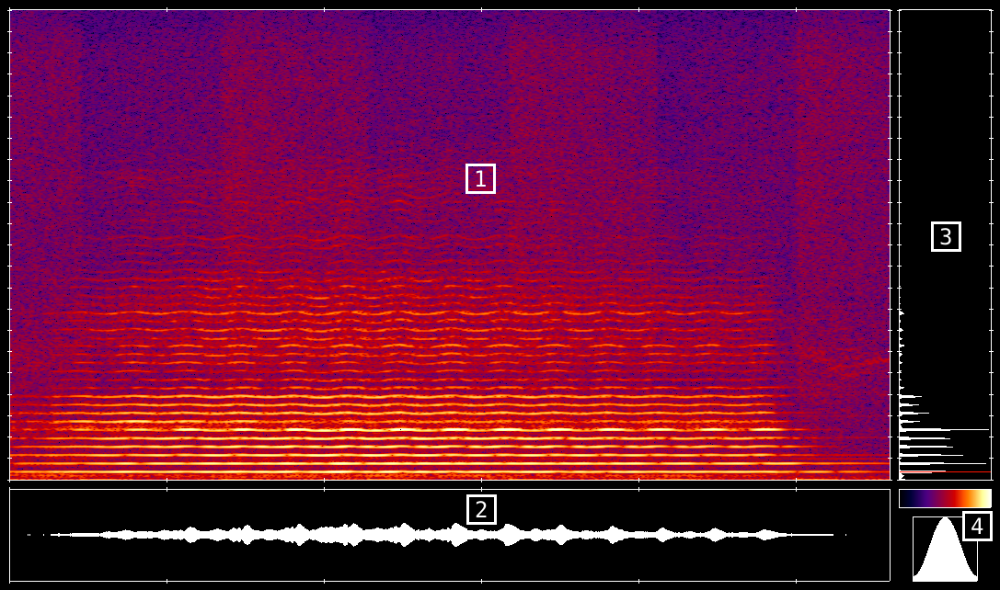

# Spectrogram

Spectrogram je aplikace pro generování spektrogramů ze zvukových souborů.

## Instalace
### Závislosti
Spectrogram závisí na těchto knihovnách (v závorce uvedena verze, pro kterou je program testovaný):
 * libpng (1.6.29)
 * png++ (0.2.9)
 * libsndfile (1.0.28)

Poznámka: Program byl vyvíjen a testován v GNU/Linuxu, případná funkčnost pod Windows není zaručena.
### Kompilace
V repozitáři je připraven `Makefile`, po instalaci závislostí kompilaci programu spustíme příkazem `make`.

## Spuštění
Pro otestování chodu lze využít přiložený skript `run-examples.sh`, který spustí zpracování přiložených audio souborů s různými parametry.
Pro zobrazení help zprávy spusťte program argumentů, případně s přepínačem `-h`.
```
Použití: ./spectrogram [PŘEPÍNAČE] VSTUPNÍ_SOUBOR
Generuje spektrogram ve formátu png ze VSTUPNÍHO SOUBORU.

  -c KANÁL			ze VSTUPNÍHO SOUBORU čte KANÁL. Výchozí hodnota je 0 (1. kanál). Týká se pouze stereo nahrávek.
  -o VÝSTUPNÍ_SOUBOR		specifikuje název výstupní bitmapy. Výchozí název je output.png
  -t VELIKOST			nastaví velikost rámce pro FFT. Výchozí hodnota je 1024. VELIKOST musí být mocnina 2
  -s DÉLKA			nastaví délku posunutí rámce FFT. Výchozí hodnota je 128. Ovlivňuje výslednou šířku spektrogramu
  -w WINDOW_FUNKCE		použije vybranou window funkci

Seznam window funkcí:
  rect		 Obdélníková window funkce
  hann		 Hann window funkce
  hamming	 Hamming window funkce
  blackmann	 Blackman window funkce
```

### Příklad použití
Pro základní použití specifikujte pouze název vstupního souboru:
`./spectrogram nahravka.wav`
Spektrogram bude vygenerován do souboru `output.png`.

Příklad pokročilého nastavení:
`./spectrogram -c 1 -t 512 -s 1000 -w blackmann -o nahravka.png nahravka.wav`
Spektrogram bude vygenerován z pravého kanálu, za použití velikosti rámce `512`, délky posunutí `1000`, s window funkcí `blackmann`. Výsledný soubor bude pojmenován `nahravka.png`.

## Čtení výstupu

1. Spektrogram [x = čas (po 500ms), y = frekvence (po 1000Hz), barva = intenzita]
2. Průběh zvukové vlny [x = čas (po 500ms)]
3. Průměrné hodnoty spektrogramu a zvýraznění fundamentální frekvence [x = intenzita, y = frekvence (po 1000Hz)]
4. Znázornění barevného měřítka spektrogramu [x = intenzita frekvence od nejnižší hodnoty v nahrávce po nejvyšší] a použité window funkce

# Implementace
## Popis funkce programu
Program implementuje algoritmus zpracování signálu pomocí [short-time Fourier transform](https://en.wikipedia.org/wiki/Short-time_Fourier_transform). Posuvné okénko postupně prochází celou nahrávku, při každém posunutí se spočítá Fourierova transormace (použit [Cooley-Turkey FFT algoritmus](https://en.wikipedia.org/wiki/Cooley%E2%80%93Tukey_FFT_algorithm)) daného kousku vstupu a zapíše se do tabulky výsledků. Po průchodu souboru se výsledek vykreslí do výstupního souboru.

### Podrobný popis
Pro čtení vstupního souboru byla využita knihovna `libsndfile`, která zajišťuje kompatibilitu s nekomerčními zvukovými formáty. Vstup se čte sekvenčně, do paměti se vždy načte pouze potřebný počet samplů. Třída `ChannelReader` z výstupu knihovny `libsndfile` přečte jeden zvolený kanál. Třída `SlidingWindow` zajišťuje posouvání čtecího okénka, je také speciálně implementován případ pro posun větší než je velikost okénka, ten se hodí zejména u dlouhých vstupů.

Na přečtená data se aplikuje _window funkce_ (zajíšťují potomci třídy `WindowFunction`). Pro zrychlení chodu programu je window funkce předpočítána.

Na upravená data se spustí algoritmus FFT (třída `FFT`), zde je také implementována optimalizace předpočítáním opakujících se hodnot. Pro implementaci použitého algoritmu jsem čerpal z [článku na wikipedii](https://en.wikipedia.org/wiki/Cooley%E2%80%93Tukey_FFT_algorithm) a z veřejně dostupného kódu na [rosettacode.org](https://rosettacode.org/wiki/Fast_Fourier_transform#C.2B.2B).

Výsledek FFT a vlnová funkce se předají do tříd zajišťujících grafický výstup (třídy v souboru `image_output.cpp`). Protože použitá knihovna `libpng` obstarává pouze převod 2d pole pixelů do png souboru, struktura vykreslování byla implementována od základů. Z toho důvodu také na obrázku není žádný text - usoudil jsem, že implementace renderování písma je nad rámec zápočtového programu. Třída `ImageOutput` při zavolání metody `renderImage` vypočítá konečné rozměry obrázku a vykreslí všechny `ImageBlock`. Potomci abstraktní třídy `ImageBlock` jsou jednotlivé komponenty, ze kterého je složený výsledný obrázek - tedy třída `FFTRenderer` (vykreslení spektrogramu [1]), `WaveRenderer` (vykreslení vlnového průběhu [2]), `AveragesRenderer` (vykreslení průměrných hodnot spektrogramu [3]), `WindowRenderer` (znázornění window funkce [4]), `ScaleRenderer` (vykreslení měřítka jednotlivých bloků).